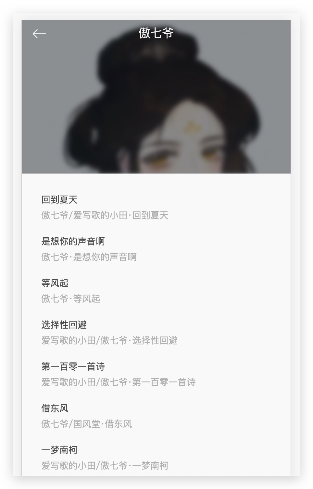

## 预览





~~[线上地址]()~~

## 总结

### 命名规范

良好的命名规范能够在绝大多数工程中增加可读性、开发体验和可维护性。常见的单文件命名方式有：

- 羊肉串命名法 `my-components`
- 大驼峰命名法 `My-Components`

> 本项目采用的是大驼峰命名法，是因为编辑器支持度更友好。

#### 基础组件

基础组件的功能可以概述为：应用于特定样式和约定，为你的应用奠定一致的基础样式和行为。

只能包括：

- HTML
- 其他基础组件
- 第三方 UI 组件库

**一定不包含全局状态（Vuex），没有业务逻辑，单纯的向外派发事件或者渲染内容。**

> 本项目采用`Base`作为基础组件的前缀进行命名

#### 单例组件

只拥有一个实例的组件称之为单例组件，但并不代表这个组件只能用于一个单页面，而是在一个页面只能使用一次。

同时，这些组件**不能接受任何 prop，他们是为应用订制的，不是应用中的上下文。**

> 本项目采用`The`作为单例组件的前缀进行命名

#### 耦合组件

和父组件紧密耦合的子组件应该以父组件名作为前缀进行命名，这样能够强调该组件只能在某个组件的场景下才有意义，所以这层关系首先要体现在名字上。

同时在编辑器中会按照字母顺序将文件组织有序，提高开发体验。

## 项目结构

### 组件拆分思路

以推荐页面为例：

#### 推荐页面

**TheRecommend**

将整个推荐页面抽象成一个树根，节点为`TheRecommend`单例组件。作为推荐业务逻辑的容器，负责整合其他功能，例如：轮播、人气歌单、热门歌曲。

**RecommendMenus**

- 人气歌单推荐功能本身就是耦合于推荐页面的，因此将其抽象成耦合组件`RecommendMenus`。

- 该组件主要提供交互逻辑（滚动），以及推荐歌单的承载。

- 由于其主要功能可以抽象成每个歌单展示组件，所以又抽象出用于展示歌单的`BaseMenuCover`组件。

**RecommendSongs**

- 同样和推荐页面耦合，以及和`RecommendMenus`组件高度相似。

- 提供和播放器的交互逻辑，以及推荐歌曲的承载 - 同样和推荐页面耦合，以及和`RecommendMenus`组件高度相似。

- 提供和播放器的交互逻辑，以及推荐歌曲的承载。

- 同样，也抽象出用于展示歌曲的`BaseSongList`组件。

**BaseScroll**

由于该项目很多地方都需要滚动功能，因此对`better-Scroll`进行二次封装，以便我们使用。 关于 better-scroll 请查阅下文难点部分总结。

## 难点总结

### 封装轮播图

虽然更多时候我们都是直接引用别人封装好的，但是作为新时代的我们，还是有必要学习一下如何封装轮播图组件的！

#### 结构和样式

最外层通过slider将轮播图和dots进行封装，他的高度和宽度由轮播图自动撑开，不需要单独设置。

轮播图有两层结构，最外层容器用来控制轮播图的整体样式，例如水平不换行，溢出隐藏。

内层容器将每个图片以及覆盖上面的超链进行封装，这里需要将其浮动起来（`inline-block`也行，但是会有间隙，不如浮动更直观），使得能够一字排开。

关于dots，这里采用绝对定位将整体定位到需要的位置上，让每个dot一字排开，这里采用的是`inline-block`.

下面是核心代码：

```html
<div class="slider">
    <div class="slider-group">
      <slot></slot>
    </div>
    <div class="dots">
      <span
        class="dot"
        :class="{ active: currentPageIndex === index }"
        v-for="(item, index) in dots"
        :key="index"
      ></span>
    </div>
  </div>
```

```css
.slider
  min-height: 1px
  .slider-group
    /*保证水平不换行，同时*/
    position: relative
    overflow: hidden
    white-space: nowrap
    .slider-item
      float: left
      box-sizing: border-box
      overflow: hidden
      text-align: center
      a
        display: block
        width: 100%
        overflow: hidden
        text-decoration: none
      img
        display: block
        width: 100%
  .dots
    position: absolute
    right: 0
    left: 0
    bottom: 12px
    transform: translateZ(1px)
    text-align: center
    font-size: 0
    .dot
      display: inline-block
      margin: 0 4px
      width: 8px
      height: 8px
      border-radius: 50%
      background: $color-text-l
      &.active
        width: 20px
        border-radius: 5px
        background: $color-text-ll
```

#### 功能分析

能够通过外部控制的功能：

loop：是否循环播放
autoPlay：是否自动轮播
interval：轮播间隙

映射到组件，即为内部的props。

#### 实现思路

1. 在初始化组件时，需要做四件事：

- 动态设置轮播图容器宽度，以及子项的class属性，保证样式正确
- 动态计算dots数量
- 初始化better-scroll
- 注册resize事件

2. 初始化better-scroll时需要注册交互逻辑处理，在代码中已给出详细注释

3. 边界处理：当视口宽度发生改变后，需要重新计算轮播图内容大小，并刷新betterScroll

4. dots联动，通过一个变量控制样式即可。

#### 手势封装

- [ ] 我会回来的！

### 播放器逻辑

多个组件都可以操作播放器，并且当播放器缩小后，播放器还可以在后台运行。

所以将播放器的数据存储在vuex是比较合适的，这样能够让多个单例组件共享同一个播放状态。

#### 状态设计

通过功能分析，可以将状态拆分如下几类：

- 控制播放器的状态：

  - 是否在播放?
  - 是否全屏展示？

- 控制播放器歌曲的状态：

  - 播放的歌曲列表？
  - 歌单的序列？
  - 播放模式？随机？顺序播放？
  - 当前播放到第几个？

- 播放器文案：
  - 待定

通过对播放器状态的初步分析，可以写出如下字段

```js
const state = {
  singer: {},
  playing: false,
  fullScreen: false,
  playlist: [], // 源歌单数据
  sequenceList: [],
  mode: playMode.sequence,
  currentIndex: -1

  /*mode =>>
  sequence: 0, 顺序播放
  loop: 1, 单曲循环
  random: 2 随机播放
*/
};
```

最后把额外对应的 mutations 以及 mutations-types 进行编写，对于 actions 等到需要有 **异步请求** 或 **合并多个 mutations** 时在写~

在设计组件状态时，跟黄哥学到了一条规则：**state 中只保存最底层的数据，对数据的计算全部移入到 getter 中。**

例如在状态中定义了 `currentIndex` 标识当前歌曲播放的索引，可以通过 `playlist[currentIndex]` 获取对应的歌曲名。

```js
/getters.js

export const currentSong = (state) => {
  return state.playlist[state.currentIndex] || {}
}
```

#### 步骤总结

1. 搭建播放器基础页面
2. 调通 vuex 状态流，并获取正确数据
3. 初步增加播放器交互事件
   - 收起、弹出播放器
   - 控制 radio 的播放状态
4. 歌曲前进后退功能
5. 进度条功能
6. 播放顺序以及收藏功能

### v-lazy 实现原理

### 歌手速览

通过该页面的学习和开发，总结如下收获：

- 定制化数据处理
- 联动组件
  - 字母表交互：拖动、单点，实时更新内容区域
  - 内容区域交互：拖动，实时更新字母表
- vuex 处理路由间传参
- 通讯录/排行榜/地区搜索等功能的开发思路

#### 格式化数据

需要对数据进行**格式化**操作，主要用于分组展示歌手，以及字母表的渲染。

- 通过统一的 Singer 类，对歌手数据进行封装
- 对歌手数据处理分组：
  - 获取歌手拼音后记录首字母，为标题展示提供数据。
  - 对歌手进行分组，已首字母为基准。
  - 根据首字母的[ASCII 码进行排序](https://developer.mozilla.org/zh-CN/docs/Web/JavaScript/Reference/Global_Objects/String/charAt)
- 默认前十条数据为热门歌手
  - 将热门数据放入处理好的数据首位

#### 长列表滚动

由于前期对 BetterScroll 组件进行了封装，在这里直接调用该组件即可。

#### 组件联动

**内容区域拖动，能够实时更新字母表的功能实现思路可以归纳如下步骤：**

1. 获取当前滚动位置
2. 计算每个歌手区间`[热门，Z]`的高度，存储到数组中
3. 监控 scrollY 的变化，计算滚动位置对应的索引值
4. 传递给字母表，使其改变高亮对应的索引项

> 代码中已用 NOTE x 标注了逻辑顺序，在当前文件中通过 todoTree 进行标签筛选，即可快速代码逻辑

**点击字母表，跳转到对应的歌手区间功能的实现思路，归纳如下步骤：**

1. 在遍历生成每个字母时，向 dom 元素上挂载`data-index = index`
2. 监听`touchstart`事件，当触发事件时取出 index，映射回歌手列表
3. 调用 betterScroll 封装好的滚动接口，滚动到指定位置即可

**拖动字母表，动态更新歌手区间和高亮字母表，归纳如下步骤：**

1. 记录`touchstart`事件触发时的索引（anchorIndex）和 y 轴坐标 y1
2. 监听`touchmove`事件，当最后一次触发时其 y 轴坐标(y2)和 y1 进行 diff，取出差值
3. 拿差值 / ANCHOR_HEIGHT 并向下取整，得到的就是当前**移动的索引数量**（delta）
4. 取 anchorIndex 和 delta 相加后得到即为最终的索引位置
5. 调用 betterScroll 封装好的接口，将歌手区间移动到指定位置即可
6. 当歌手区间发生移动后 scrollY 随之改变，会自动计算对应到字母表中的高亮索引并更新

#### vuex 处理路由间传参

当点击某一歌手后，需要跳转到二级路由 -> 歌手详情页面。

可以通过 vuex 来管理歌手信息，这样当路由发生跳转的同时会将数据存储到 vuex 中，当下一个事件循环渲染组件时即可拿到歌手数据。
